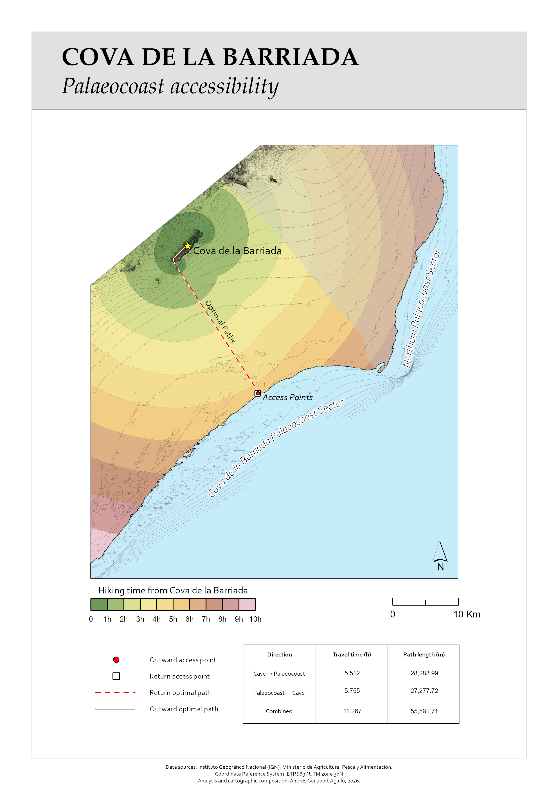

# Least-Cost Modelling of Gravettian Palaeocoastal Accessibility

**Cova de la Barriada · Benidorm, Spain**

<p align="center">

</p>

GIS-based reconstruction and least-cost accessibility modelling of the Gravettian palaeocoast surrounding Cova de la Barriada.

---

### Notebook

[**View the complete ArcGIS Pro workflow →**](NOTEBOOK/COVA_BARRIADA_LEAST_COST_MODELLING.ipynb)

A **reproducible ArcGIS Pro Notebook workflow** covering the complete analysis, from data preparation and terrain modelling to accessibility analysis and least-cost path generation.

### Project

This project reconstructs the Mediterranean palaeocoast at approximately **−100 m sea level** and uses terrain-based least-cost modelling to investigate accessibility between the archaeological site and different coastal sectors.

The analysis identifies the **most accessible coastal sector**, its least-cost access point, and the optimal route from the cave.

### Outputs

The workflow produces:

- Reconstructed palaeocoast
- Coastal accessibility sectors
- Travel-time isochrones
- Least-cost access points
- Optimal routes between the cave and palaeocoast

### Project Structure

```text
DATA/        Input and reference datasets
NOTEBOOK/    Reproducible ArcGIS Pro workflow
OUTPUT/      Final GIS outputs
FIGURES/     Cartographic outputs for presentation
TEMPLATES/   ArcGIS Pro map and layout templates
